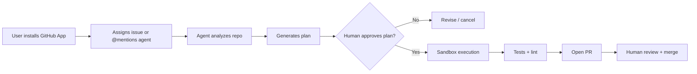

# GitForge AI Engineer — Product Requirements Document (PRD)

## 1.1 Vision

Build a **production-ready AI Software Engineer Agent** that integrates with GitHub to autonomously understand repositories, execute engineering tasks, and deliver reviewable pull requests—while keeping humans in control of approvals, secrets, and merges.

Positioned between:

- **Cursor** (IDE-embedded, interactive pair programming)
- **Devin / Cognition** (autonomous task execution in sandbox)
- **GitHub Copilot Workspace** (GitHub-native, plan-driven)

---

## 1.2 Problem Statement

Engineering teams spend significant time on repetitive, well-scoped work: bug fixes, test additions, dependency updates, refactors, and boilerplate features. Existing tools either:

- Require constant human steering (chat-based copilots), or
- Lack transparency, auditability, and enterprise controls (early autonomous agents).

There is no **GitHub-first, auditable, sandboxed agent** that can take a GitHub Issue → branch → PR with traceable reasoning, cost controls, and policy enforcement.

---

## 1.3 Target Users

| Persona | Need |
|---------|------|
| **Individual developer** | Offload scoped tasks while reviewing diffs |
| **Tech lead / Staff engineer** | Enforce standards, review agent output, tune policies |
| **Open-source maintainer** | Triage issues, auto-generate fix PRs |
| **Hiring manager / reviewer** | Evaluate candidate via a credible, deployed system |

---

## 1.4 Goals (MVP → V1)

### MVP (8–10 weeks)

- GitHub OAuth + App installation on repos
- Issue/comment-triggered agent runs
- Repo indexing (AST + embeddings)
- Plan → implement → test → PR workflow
- Web dashboard for run status, logs, diffs
- Sandboxed command execution (Docker)
- Human approval before push/PR

### V1 (Production)

- Multi-repo org support
- CI integration and auto-fix loops
- Cost/rate limits per org
- RBAC, audit logs, SOC2-ready patterns
- Streaming run timeline (SSE/WebSocket)
- Eval harness for agent quality

---

## 1.5 Non-Goals (MVP)

- Full IDE replacement
- Unsupervised production deploys
- Mobile app
- Self-hosted LLM training/fine-tuning pipeline
- Arbitrary internet browsing without allowlists

---

## 1.6 Success Metrics

| Metric | Target |
|--------|--------|
| Task completion rate (scoped issues) | ≥ 60% mergeable PR without rework |
| Median time issue → PR | < 30 min |
| Human edit rate on agent diffs | < 40% lines changed |
| P95 agent run latency | < 45 min |
| Cost per successful PR | < $3 (GPT-4 class) |
| Uptime (API + worker) | 99.5% |

---

## 1.7 Core User Flows

